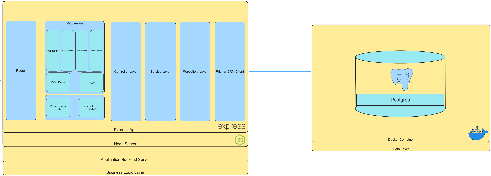

# Readify

A book reading, review, and recommendation website with a chat-with-a-book module.

## Technologies

- Node.js
- TypeScript
- Express
- PostgreSQL
- Prisma
- JWT Authentication
- Swagger
- Docker
- GitHub Actions
- Jest

## Architecture

### System Architecture



## Running the app

1. **Clone the repository:**

```bash
git clone https://github.com/Eight-Horsepeople-of-the-Graduation/core.git
cd core
```

2. **Install required packages:**

```bash
pnpm install # can also use npm or yarn instead of pnpm
```

3. **Build and start the Postgres Docker container:**

*Make sure to have [Docker Compose](https://docs.docker.com/compose/install/) installed.*

```bash
docker-compose up -d
```

This command will start the Postgres container in detached mode.

4. **Generate Prisma artifacts:**

```bash
pnpm dlx prisma generate # can also use npx instead of 'pnpm dlx'
```

This command will generate Prisma artifacts required for the repositories to work properly.

5. **Copy the environment variables file:**

```bash
cp .env.example .env
```

Then replace the current values with desired values.

6. **Run the application:**

```bash
# development
$ pnpm run start

# watch mode
$ pnpm run start:dev
```

## Testing the app

```bash
# unit tests
$ pnpm run test
```

## Usage

## Roadmap

- []

## Acknowledgments

<!-- # References

- [Project Database Diagram](https://dbdiagram.io/d/65c3c826ac844320aead1fcb)
- [Postgres Image](https://hub.docker.com/_/postgres )
- [Prisma Docs](https://www.prisma.io/docs/)
- [Bulletproof Node.js Boilerplate](https://www.softwareontheroad.com/ideal-nodejs-project-structure/)
- [Conventional Commits](https://www.conventionalcommits.org/en/v1.0.0/)

# Milestones

## Models

- [x] User
- [x] Author
- [x] ReadingChallenge
- [x] Book
- [x] Bookshelf
- [x] Review
- [x] Genre -->
